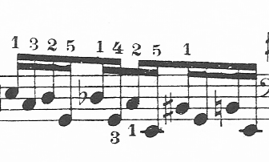

If you are new to Engraving Challenges,
---------------------------------------

...we suggest that you don't start with this one -
rather, read the instructions in the
[main repository](https://github.com/engraving-challenges/main)
and then start by working on
[this challenge](https://github.com/engraving-challenges/estrella).

### Chopin/Godowsky study

As the idea for the **_Scores of Beauty_ Engraving Challenges** arose from engraving complex
late-romantic piano music it seemed natural to start with such a challenge.
We found something which we found ideal:
[Leopold Godowsky](http://en.wikipedia.org/wiki/Leopold_Godowsky)'s
arrangements of Schubert songs, a music that is flourishing with wonderful polyphonic
additions and inventions - and an engraver's nightmare ;-)
The issue is that - although Godowsky died more than 70 years ago, giving his music
to the public domain in most countries - these pieces have been published in the U.S.
less than 90 years ago ...

After some pondering I recalled the five volumes of Godowksy's "Studies on Chopin's studies"
that I own but (as a pianist) never dared to touch so far. These pieces have been published
in Germany, so they are actually free to use (because there isn't such a long time protection
regarding the *publication* date in the EU).  
Surprisingly, most of them are quite simple notation-wise, but I think I found one nice example
that would be a challenging task: a page from the study on Chopin's study in a minor op. 25/11.
You'll find it in the [PNG file](chopin-godowsky.png) in this directory.

As this doesn't contain a title please also refer to
[chopin-godowsky-title](titles.md).

**Important:** please make sure you read the [instructions](http://github.com/engraving-challenges/main/blob/master/README.md#instructions) before starting any work!

---

Please remember: this is a challenge and only partly a contest. There is no deadline.
The point is to try creating the most beautiful engraving with notation package of your choice,
and document your progress on your way there.

For general information on the challenges as well as specific instructions
for participants, please refer to the
[main repository](https://github.com/engraving-challenges/main).
