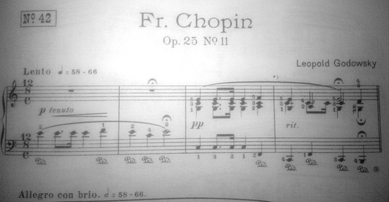

## Engraving Challenge #1

### Titles

The main score example is one page from a piece and thus doesn't have a title
or time signature.

Here we have the titles from this piece:

We don't need *everything* from that, but what should be taken is:

- Title and subtitle
- Composer
- Number box
- Time signature  
  I think we can use the more common notation printing the two alternatives
  side by side
- The second tempo marking (Allegro ...)

I think we can leave the typography of the No. up to the user, i.e.
the non-English way to write Nr. would be OK too.
